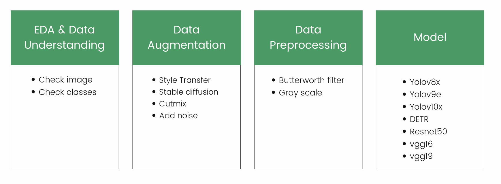

# Kiddee-liver-ultrasound-detection

## Introduction

This repository is a part of the weekly hackathon in SuperAI Engineer (Season 4). For this week is Liver Ultrasound Detection.

## Overview problem :

Hepatocellular carcinoma (HCC) and Cholangiocarcinoma (CCa) are prevalent types of liver cancer, particularly common among men. Early detection is crucial for effective treatment and improved patient outcomes. Ultrasound imaging is a primary diagnostic tool used to identify these cancers. However, identifying these conditions via ultrasound presents several challenges.

### challenges
- Detecting HCC and CCa through ultrasound images requires a high level of expertise.
- Image Quality Issues: When performing an ultrasound, doctors often capture images which they later review with the patients.

## objective
The primary goal is to develop a system capable of classifying ultrasound images to aid in the detection of HCC and CCA.

## Problem -solving Approach :

Our team has experimented with various approaches to address the challenges in liver ultrasound detection. Through extensive testing and analysis, we have identified the following approach as the most effective:

We start by **adding noise** to the images, helping the model learn to handle real-world noisy data. Advanced noise reduction techniques are then applied to enhance image clarity. For contrast enhancement, we use **histogram equalization**, which adjusts the intensity distribution of the images, making important features more distinguishable and improving the visibility of critical areas. Finally, we employ the **YOLOv9e model**, a state-of-the-art object detection algorithm, to detect and classify regions of interest within the ultrasound images, aiding radiologists in accurate diagnosis.

